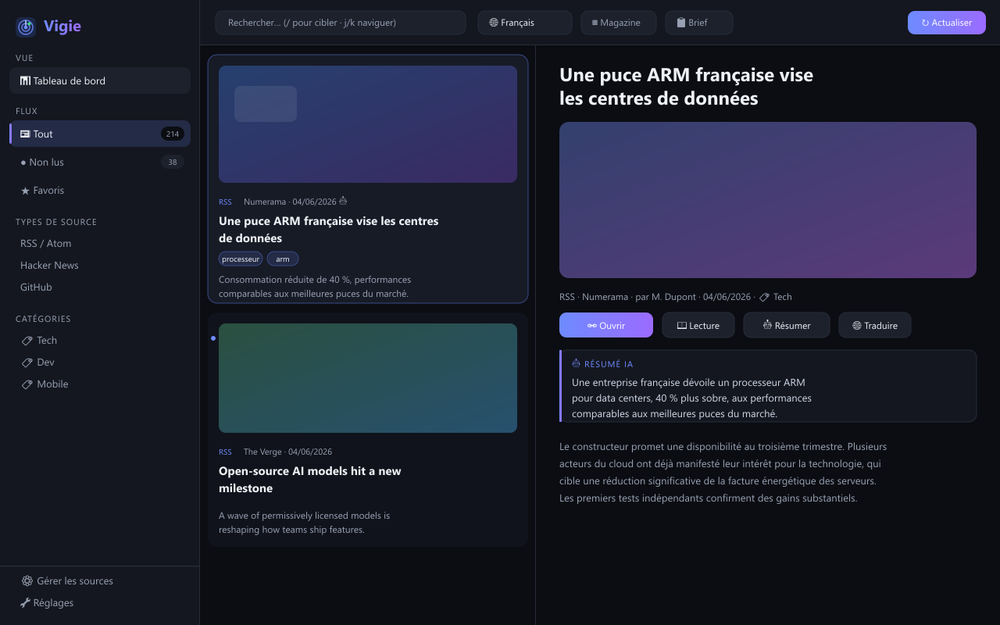
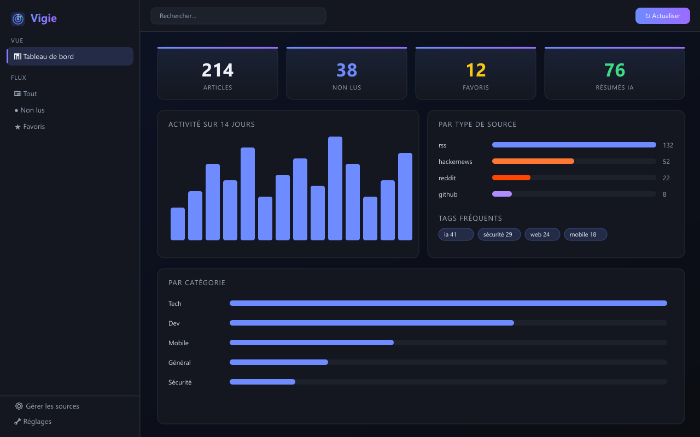

# Vigie 📡 — Wiki

> *La sentinelle de votre veille technologique.*

**Vigie** est une application de bureau (Windows) qui agrège vos sources d'actualité
technologique, en résume le contenu par IA — **gratuitement et hors-ligne** — et vous
aide à organiser votre veille, le tout **en local, sans serveur ni compte**.

## Aperçu

## Démarrage rapide

1. Installez Vigie (voir **[[Installation]]**).
2. Au premier lancement, choisissez votre **langue** et ajoutez les **sources recommandées** (assistant en 2 clics).
3. Cliquez **↻ Actualiser** : vos premiers articles arrivent.
4. Cliquez un article pour le lire ; **🤖 Résumer** pour un résumé IA instantané.

## Sommaire

- **[[Installation]]** — installer et mettre à jour Vigie
- **[[Guide d'utilisation]]** — l'interface au quotidien
- **[[Sources]]** — ajouter, gérer et importer/exporter vos flux
- **[[Résumés IA]]** — IA locale gratuite et Ollama
- **[[Langues et traduction]]** — flux multilingue + traduction
- **[[Raccourcis clavier]]** — naviguer au clavier
- **[[Réglages]]** — tous les paramètres
- **[[Sauvegarde et données]]** — où sont stockées vos données
- **[[FAQ]]** — questions fréquentes
- **[[Développement]]** — compiler depuis les sources

## Aperçu des fonctionnalités

| Domaine | Détail |
|---|---|
| Sources | RSS/Atom, GitHub (releases), Hacker News, Reddit, Mastodon |
| IA | Résumés + tags : IA locale (hors-ligne) ou Ollama (local) — sans clé ni API payante |
| Multilingue | FR, EN, ES, DE, IT, PT + détection automatique de la langue |
| Lecture | Mode lecture plein écran, texte intégral (Readability), images |
| Organisation | Catégories, tags, favoris, lu/non-lu, recherche, filtres par mots-clés |
| Productivité | Brief du jour IA, regroupement, scroll infini, export Markdown |
| Automatisation | Actualisation périodique, digest quotidien, notifications, mode plateau |
| Données | 100 % local (JSON), sauvegarde/restauration, import/export OPML |

---
© 2026 Cyberlogic — [www.cyberlogic.fr](https://www.cyberlogic.fr) · Logiciel propriétaire
